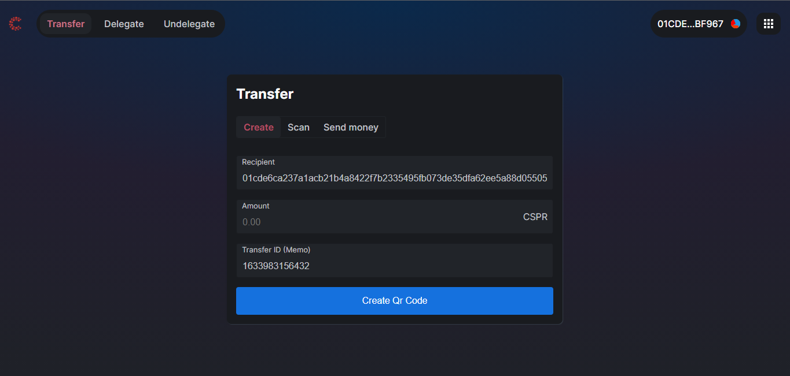
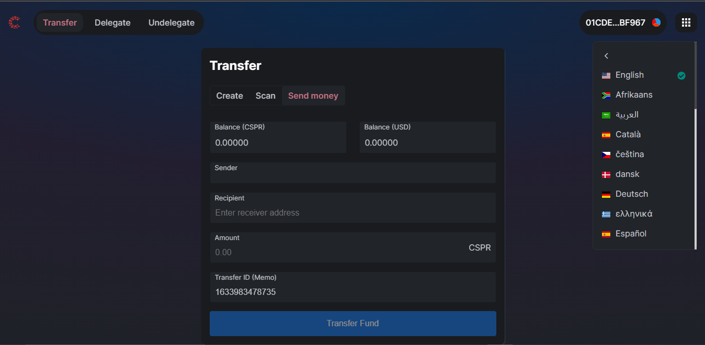
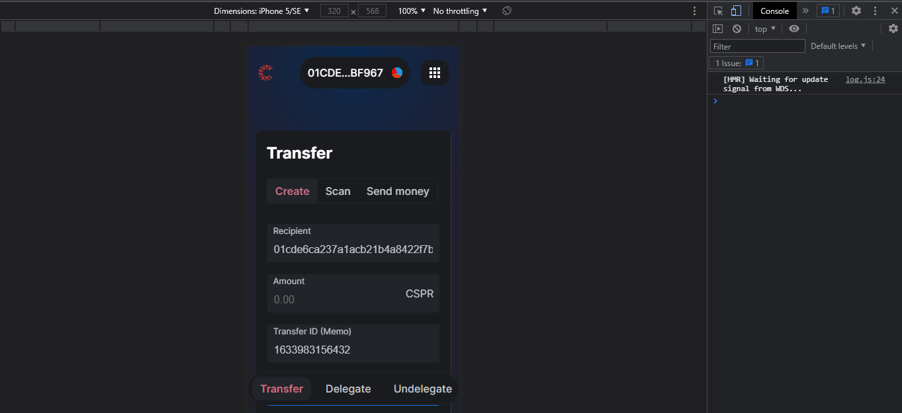
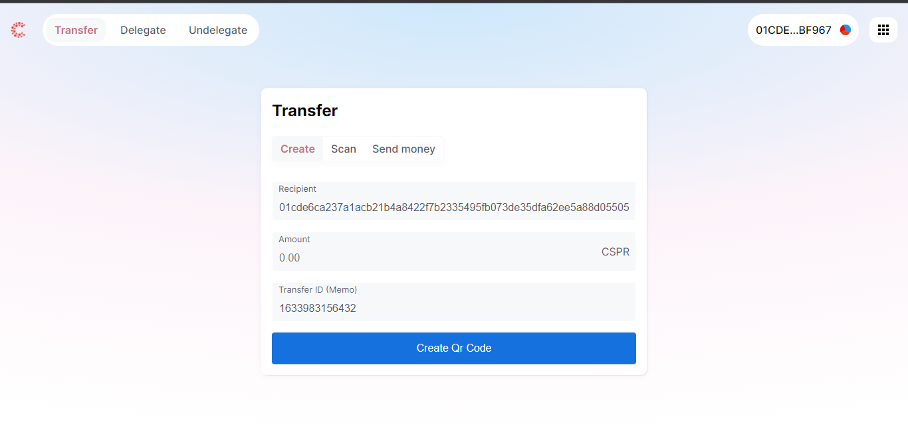

# Casper Qr Scan

This project is designed to generate Qr codes for transactions on Casper blockchain to be signed using CasperLab signer.
The following transactions are supported:

- [x] Transfer
- [ ] Delegation
- [ ] Undelegation

## UI Snapshots

Dark mode connected signer vault

Send payment view

Mobile responsive

Light mode

## Quick Links

- [View live Demo]()

## How It Works

A user navigates to the platform clicks on either Transfer, Delegate or Undelegate, a form pops out, you can either connect your wallet to automatically populate your active public key to the form or do it manually.

Generate the Qr code, download it and share to whom it may concern.

## Todo

- [x] Add localization
- [x] Add dark and light mode (themeable)
- [ ] Add Qr code scanning and loading from image
- [ ] Add ability to initiate signing deploys
- [ ] Add account balance viewing
- [ ] Add account history or transaction history viewing
